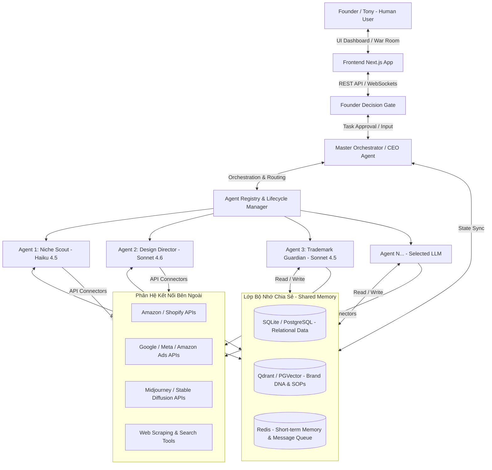

# TÀI LIỆU PHÂN TÍCH & ĐẶC TẢ THIẾT KẾ HỆ THỐNG AI OS (AGENT OPERATING SYSTEM)
**Hệ thống điều phối, quản lý và tự động hóa doanh nghiệp bằng mạng lưới Multi-Agent chuyên biệt**

---

## PHẦN I: PHÂN TÍCH CHI TIẾT HÌNH ẢNH HỆ THỐNG (EcomAIOS)

Dựa trên 5 hình ảnh được cung cấp, hệ thống **EcomAIOS** đại diện cho một mô hình phần mềm đột phá: **AI-First Company Agent Operating System** (Hệ điều hành doanh nghiệp lấy AI làm trung tâm). Dưới đây là phân tích chi tiết từng khía cạnh thiết kế và kiến trúc được thể hiện qua các hình ảnh:

### 1. Phân tích Cấu trúc Tổ chức Agent (Hình 1 - Agent Company Structure)
Hình ảnh minh họa sự chuyển dịch từ sơ đồ tổ chức nhân sự truyền thống sang sơ đồ tổ chức bằng AI Agent chuyên biệt:
*   **Founder / Tony (Con người - Human-in-the-Loop):** Đứng ở đỉnh sơ đồ, đóng vai trò đưa ra quyết định tối cao, định hướng chiến lược và thiết lập ranh giới vận hành.
*   **CEO Agent (Strategic Orchestrator):** Đóng vai trò là "bộ não" trung gian trực tiếp dưới quyền Founder. CEO Agent không làm các công việc chi tiết mà chịu trách nhiệm lập kế hoạch, điều phối chiến lược, phân chia nhiệm vụ xuống các phòng ban và thu thập báo cáo để trình lên Founder.
*   **5 Cột Phòng Ban Chuyên Biệt (Departments):**
    1.  **Market Intelligence (Nghiên cứu thị trường):** Gồm *Niche Scout* (tìm ngách sản phẩm) và *Trademark Guardian* (bảo vệ tài sản trí tuệ).
    2.  **Creative Studio (Xưởng sáng tạo):** Gồm *Design Director* (đạo diễn thiết kế), *Redesign Agent* (thiết kế lại/tối ưu), và *Video Creative* (sản xuất video).
    3.  **Listing & SEO (Tối ưu hóa hiển thị):** Gồm *Listing Architect* (xây dựng nội dung bán hàng).
    4.  **Ads & Growth (Quảng cáo & Tăng trưởng):** Gồm *PPC Commander* (điều hành quảng cáo trả phí) và *Growth Hacker* (tăng trưởng doanh số).
    5.  **Operations & Finance (Vận hành & Tài chính):** Gồm *Operations Manager* (quản lý vận hành), *Finance Controller* (kiểm soát tài chính), và *Data Analyst* (phân tích dữ liệu).
*   **Brand DNA Guardian (Cổng kiểm duyệt thương hiệu):** Chạy song song và kết nối với tất cả các phòng ban cũng như CEO Agent. Nó đảm bảo mọi đầu ra (hình ảnh, bài viết, chiến dịch) đều nhất quán với "Brand Voice" (giọng điệu thương hiệu), "Identity" (nhận diện thương hiệu) và được kiểm duyệt chặt chẽ (Audit) trước khi xuất bản.
*   **Shared Memory (Bộ nhớ chia sẻ chung):** Nền tảng bên dưới liên kết tất cả Agent, bao gồm Database (Cơ sở dữ liệu), SOP (Quy trình vận hành chuẩn), Scorecard (Bảng điểm hiệu năng), và Brand DNA.

### 2. Phân tích Luồng Dữ liệu và Pipeline Vận Hành (Hình 2 - Workflow Pipeline)
Hình 2 thể hiện cách thức dòng dữ liệu di chuyển tuyến tính qua các Agent dưới sự giám sát của CEO Agent và sự phê duyệt của Founder:
*   **Founder Decision Gate:** Nằm ở vị trí chốt chặn quyết định. Khi một quy trình đi qua các bước quan trọng, hệ thống sẽ dừng lại để Founder phê duyệt (ví dụ: duyệt thiết kế, duyệt ngân sách quảng cáo lớn).
*   **Quy trình Pipeline Tuyến tính tuần hoàn:**
    $$\text{Market Signals} \rightarrow \text{Opportunity} \rightarrow \text{IP Clear} \rightarrow \text{Design} \rightarrow \text{Listing} \rightarrow \text{Launch Ads} \rightarrow \text{Operate} \rightarrow \text{Learn (Loop back)}$$
    Vòng lặp tự học (Launch Learning Loop) lấy dữ liệu từ bước Vận hành & Học hỏi để quay lại tối ưu hóa Tín hiệu Thị trường.
*   **Đầu ra cụ thể của từng phân hệ (Outputs Registry):**
    *   *Market Intelligence* $\rightarrow$ Opportunity Scorecard (Bảng điểm cơ hội), IP Risk Note (Báo cáo rủi ro bản quyền).
    *   *Creative Studio* $\rightarrow$ Design Brief (Bản yêu cầu thiết kế), 7 Mockups (7 bản mẫu trực quan), Product Video (Video sản phẩm).
    *   *Listing & SEO* $\rightarrow$ Title (Tiêu đề), Bullets (Mô tả đặc điểm), Keywords (Từ khóa SEO), A+ Angle (Góc độ thiết kế trang A+).
    *   *Ads & Growth* $\rightarrow$ PPC Plan (Kế hoạch quảng cáo), Keyword Harvest (Thu hoạch từ khóa), Scale Plan (Kế hoạch mở rộng).
    *   *Operations & Finance* $\rightarrow$ Account Health (Sức khỏe tài khoản), Unit Economics (Kinh tế trên từng đơn vị sản phẩm), KPI Dashboard (Bảng điều khiển chỉ số).
*   **Hạ tầng kỹ thuật Shared Memory:** Cơ sở dữ liệu SQLite, Agent Skills (Bộ kỹ năng của Agent), Automation Scripts (Các kịch bản tự động hóa), và Dashboard/War Room.

### 3. Phân tích 10 Vai trò Agent Trong Thực Tế POD & E-Commerce (Hình 3 - EcomAIOS Vietnamese Concept)
Bản vẽ tay hóa giải thích bằng tiếng Việt về lợi ích và vai trò cụ thể của 10 Agent tự động hóa >95% quy trình POD & Amazon E-commerce:
*   **Lợi ích cốt lõi:** Tiết kiệm 90% thời gian, tối ưu từng bước, ra quyết định bằng dữ liệu, vận hành tự động >95%.
*   **Mô tả nhiệm vụ & Output của 10 Agent:**
    1.  **CEO Agent:** Điều phối toàn công ty, ưu tiên chiến lược, ra quyết định vận hành. *Output: Kế hoạch hành động.*
    2.  **Niche Scout:** Tìm ngách sản phẩm POD tiềm năng, phân tích từ khóa, chấm điểm cơ hội. *Output: Niche scorecard.*
    3.  **Trademark Guardian:** Kiểm tra bản quyền nhãn hiệu thương mại, rà soát rủi ro sở hữu trí tuệ (IP). *Output: GO/NO-GO.*
    4.  **Design Director:** Tạo bản yêu cầu thiết kế, định hình ý tưởng sản phẩm, viết prompt cho các AI tạo ảnh (Midjourney/Stable Diffusion). *Output: Batch thiết kế.*
    5.  **Listing Architect:** Viết tiêu đề, 5 dòng mô tả sản phẩm (bullet points), tối ưu hóa SEO backend keywords và tỷ lệ chuyển đổi. *Output: Listing tối ưu.*
    6.  **PPC Commander:** Thiết lập chiến dịch quảng cáo, tự động tối ưu hóa giá thầu (bid), tối ưu hóa chỉ số ACoS/ROAS. *Output: Ads ready to scale.*
    7.  **Data Analyst:** Theo dõi Dashboard KPI, phân tích xu hướng bán hàng, phát hiện các bất thường (anomaly detection). *Output: Insight hàng tuần.*
    8.  **Finance Controller:** Theo dõi doanh thu, chi phí, biên lợi nhuận, chi phí quảng cáo, tính unit economics. *Output: Báo cáo P&L & ROI.*
    9.  **Operations Manager:** Giám sát sức khỏe tài khoản bán hàng, theo dõi quá trình hoàn thiện đơn hàng (fulfillment), tự động hóa chăm sóc khách hàng. *Output: Vận hành ổn định.*
    10. **Growth Hacker:** Tìm sản phẩm bán chạy để nhân bản (scale winner), thiết lập chiến lược bán combo/bundle, tối ưu hóa giá bán (pricing), lên kế hoạch launching sản phẩm mới. *Output: Tăng trưởng doanh số.*
*   **Master Orchestrator (Trọng tâm phần mềm):** Là công cụ điều phối, đồng bộ dữ liệu, tự động hóa pipeline và tối ưu hóa liên tục. Nhận Input (Ý tưởng, Niche/Keyword, Dữ liệu bán hàng, Ngân sách) và trả ra Output (Hệ thống tự chạy, Sản phẩm LIVE trên Amazon, Listing SEO, Ads scale, Dashboard tài chính).

### 4. Phân tích Giao diện Phần mềm (Hình 4 - Dashboard Interface)
Giao diện thực tế của phần mềm EcomAIOS được thiết kế với thẩm mỹ tối giản, chuyên nghiệp và rất hiện đại (Sleek Dark Mode):
*   **Thống kê tổng quan (Top Metrics Bar):** Hiển thị số lượng Task đang chạy (8/14), số Agent hoạt động hôm nay (1 running, 0 pending, 0 failed), số lượng Agent LIVE (12) và Net Profit ($7051.59).
*   **Thanh điều hướng bên trái (Sidebar):**
    *   *Workspace:* Home, Mission Control (Trung tâm kích hoạt nhiệm vụ), Scheduled (Lịch trình chạy tự động), Agents (Quản lý Agent), Chat (Kênh chat trực tiếp).
    *   *Intelligence:* Memories (Cơ sở tri thức/Bộ nhớ), Hive Mind (Mạng lưới trí tuệ tập thể), Usage (Mức độ tiêu thụ tài nguyên/Token), Audit (Nhật ký kiểm toán hoạt động).
    *   *Collaborate:* War Room (Phòng họp chiến lược giữa người và các Agent).
    *   *Configure:* Settings.
*   **Vùng trung tâm - Mạng lưới nhân sự AI (Workforce Node-Graph):** Một bản đồ tương tác dạng đồ thị (graph) trực quan hóa. Người dùng ("Main") nằm ở trung tâm, kết nối xung quanh là các Node đại diện cho 10 Agent. Các đường nối thể hiện các luồng giao tiếp thời gian thực, có chấm sáng nhấp nháy chỉ trạng thái Agent đang truyền tải dữ liệu cho nhau.
*   **Bảng hoạt động thời gian thực (Live Activity Feed):** Cột bên trái hiển thị dòng suy nghĩ và log làm việc của Agent dưới dạng hội thoại tự nhiên (VD: LISTING báo cáo đã tối ưu xong bộ từ khóa Father's Day; FINANCE báo cáo đã kiểm soát cost basis...).
*   **Tiến độ sản phẩm (Product Pipeline):** Cột bên phải giám sát số lượng sản phẩm đang đi qua các công đoạn (Listing, Design Brief, Approved, Live...).
*   **Diagnostics & Costs (Biểu đồ chi phí):** Biểu đồ cột giám sát chi phí sử dụng API của các mô hình ngôn ngữ lớn (Claude/GPT) theo thời gian thực (CLAUDE OPS COST).

### 5. Phân tích Quản lý Cấu hình Agent & Swapping Model (Hình 5 - Agent Config)
Hình 5 cho thấy tính năng linh hoạt và thực tế nhất của nền tảng:
*   **Cơ chế Swapping Model:** Mỗi Agent có thể được chỉ định một mô hình ngôn ngữ riêng biệt tùy thuộc vào độ phức tạp của nhiệm vụ.
    *   *Agent Main (CEO)*: Đang chạy trên mô hình cao cấp **Opus 4.6** (Mô hình mạnh nhất để lập kế hoạch và điều phối). Chi phí hôm nay: \$3.40.
    *   *Agent Data Analyst*: Đang dùng mô hình tối ưu hiệu năng/chi phí **Sonnet 4.6** (đang offline), số lượt tương tác hôm nay: 6, chi phí: \$0.61.
    *   *Lựa chọn linh hoạt:* Người dùng có thể click chọn menu thả xuống để đổi model giữa: *Opus 4.6*, *Sonnet 4.6*, *Sonnet 4.5*, *Haiku 4.5* nhằm tối ưu hóa ngân sách API tối đa.
*   **Bộ nút điều khiển cục bộ:** Mỗi thẻ Agent có các nút: *Start/Stop* (Bật/tắt hoạt động của Agent), *View Documentation/Prompt*, *Reset Memory* (Xóa bộ nhớ tạm thời), và *Delete* (Xóa Agent khỏi hệ thống).

---

## PHẦN II: BẢN MÔ TẢ CHI TIẾT THIẾT KẾ PHẦN MỀM AI OS
*(Tài liệu Đặc tả Yêu cầu Kỹ thuật và Kiến trúc - Software Requirements Specification)*

### 1. Tổng Quan Hệ Thống (Executive Summary)
**AI OS (Agent Operating System)** là một nền tảng phần mềm doanh nghiệp (B2B SaaS hoặc Private Cloud) giúp thiết lập, quản lý, điều phối và tự động hóa quy trình kinh doanh thông qua một mạng lưới các **AI Agent chuyên biệt**. Nền tảng cho phép doanh nghiệp:
*   **Giao việc bằng ngôn ngữ tự nhiên:** Giao các mục tiêu kinh doanh lớn cho CEO Agent tự động phân rã thành các nhiệm vụ nhỏ hơn.
*   **Quản lý vòng đời Agent:** Thêm mới, xóa bỏ, chỉnh sửa cấu hình, hướng dẫn (prompting), trang bị công cụ (tools) cho từng Agent.
*   **Giám sát hoạt động thời gian thực:** Trực quan hóa tương tác giữa các Agent dưới dạng đồ thị luồng công việc (Workforce Graph) và dòng suy nghĩ (Thought Logs).
*   **Tối ưu hóa chi phí:** Tự do chuyển đổi mô hình AI (Model Swapping) cho từng Agent để đạt tỷ lệ Hiệu năng / Chi phí tốt nhất.
*   **Human-in-the-Loop:** Cơ chế phê duyệt thông minh (Decision Gate) giữ con người làm trọng tâm kiểm duyệt các hành động có rủi ro cao (chuyển tiền, xuất bản nội dung, duyệt ngân sách quảng cáo).

---

### 2. Sơ Đồ Kiến Trúc Hệ Thống (System Architecture)

Dưới đây là mô hình kiến trúc tổng quát của AI OS:



---

### 3. Thiết Kế Các Phân Hệ Core (Core Subsystems Specification)

#### A. Phân Hệ Điều Phối Master Orchestrator (CEO Agent Engine)
Đây là hạt nhân của AI OS, đóng vai trò như hệ điều phối tiến trình (Process Scheduler) trong hệ điều hành máy tính truyền thống.
*   **Bộ phân rã mục tiêu (Goal Decomposer):** Tiếp nhận mục tiêu lớn từ người dùng (VD: *"Hãy nghiên cứu ngách quà tặng ngày của Cha và chuẩn bị 20 mẫu thiết kế kèm listing để đăng lên Amazon"*). CEO Agent sử dụng LLM cao cấp để phân tích, chia nhỏ thành các Task con (Sub-tasks) và lập bản đồ phụ thuộc (DAG - Directed Acyclic Graph).
*   **Bộ định tuyến tác vụ (Task Router):** Đưa task vào hàng đợi (Queue) và kích hoạt Agent phù hợp nhất xử lý dựa trên "Skills" đã đăng ký của Agent trong Registry.
*   **Cơ chế Đồng bộ & Kiểm tra (Sync & Validate):** Nhận kết quả từ Agent A, chuyển qua Agent B kiểm tra tính hợp lệ (VD: *Niche Scout đưa ra bộ từ khóa $\rightarrow$ Trademark Guardian rà soát bản quyền thương hiệu $\rightarrow$ Nếu Đạt thì chuyển tiếp sang Design Director, nếu Không Đạt thì trả lại bắt Niche Scout làm lại*).

#### B. Phân Hệ Quản Lý Vòng Đời Agent (Agent Lifecycle Registry)
Cho phép người quản lý (Admin) toàn quyền điều phối đội ngũ nhân sự số (Digital Workforce):
*   **Thêm Agent mới (Add Agent):**
    *   Định nghĩa Tên, Vai trò (Role), ảnh đại diện (Avatar).
    *   Cấu hình System Prompt (Hướng dẫn hoạt động, quy tắc hành xử).
    *   Cấu hình bộ kỹ năng (Skills/Tools): Gán các hàm API hoặc script tự động hóa mà Agent này được phép gọi (VD: `search_web`, `read_amazon_keyword_tool`, `generate_image_prompt`).
*   **Xóa Agent (Delete Agent):** Loại bỏ Agent ra khỏi sơ đồ vận hành, giải phóng các tài nguyên bộ nhớ liên quan.
*   **Cấu hình Mô Hình Linh Hoạt (Dynamic Model Swapping):**
    *   Tích hợp cổng kết nối API đa mô hình: OpenAI (GPT-4o, GPT-4o-mini), Anthropic Claude (Claude 3.5 Sonnet, Claude 3.5 Haiku, Claude 3 Opus), Google Gemini (Gemini 1.5 Pro, Flash).
    *   Cung cấp thanh chọn thả xuống trên UI để thay đổi mô hình xử lý cho Agent đó ngay lập tức mà không cần dừng hệ thống.
*   **Hạn mức Tài chính (Cost & Token Guardrails):**
    *   Đặt ngân sách hoạt động tối đa theo ngày cho từng Agent (VD: Agent PPC Commander chỉ được tiêu tối đa \$5 tiền API một ngày).
    *   Tự động tạm dừng (Pause) Agent nếu vượt quá hạn mức và gửi cảnh báo về Telegram/Slack cho Founder.

#### C. Phân Hệ Bộ Nhớ Chia Sẻ (Shared Memory System)
Để các Agent có thể phối hợp đồng bộ, chúng cần một không gian lưu trữ và chia sẻ dữ liệu nhất quán:
*   **Bộ nhớ ngắn hạn (Short-term Memory):** Lưu trữ ngữ cảnh hội thoại hiện tại (Chat context) và các biến số truyền tải tạm thời giữa các Agent trong một Pipeline. Sử dụng Redis để tối ưu tốc độ đọc ghi.
*   **Bộ nhớ dài hạn phi cấu trúc (Semantic Memory - Vector DB):** Lưu trữ tài liệu quy chuẩn (SOP), Tri thức thương hiệu (Brand DNA), Hướng dẫn giọng điệu (Brand Voice), lịch sử các bài học kinh nghiệm. Khi Agent hoạt động, nó sẽ tự động tìm kiếm ngữ nghĩa (Semantic Search) trên Vector DB để lấy tri thức phù hợp.
*   **Bộ nhớ cấu trúc (Structured Memory - Relational DB):** Lưu trữ trạng thái hệ thống, thông tin tài khoản sản phẩm, số liệu kinh doanh, chi phí quảng cáo thu thập từ các sàn thương mại điện tử. Sử dụng PostgreSQL để đảm bảo tính toàn vẹn dữ liệu.

#### D. Phân Hệ Giao Diện Người Dùng (Sleek Interactive Dashboard UI)
Giao diện người dùng phải tạo cảm giác cao cấp (Premium Aesthetics), sống động và phản ánh đúng trạng thái "đang vận hành" của một doanh nghiệp:
*   **Trực quan hóa mạng lưới (Workforce Graph View):** Sử dụng thư viện đồ họa như `React Flow` hoặc `D3.js` để dựng biểu đồ dạng node.
    *   Mỗi Node là một Agent hiển thị trạng thái (Running, Idle, Offline, Error).
    *   Đường liên kết giữa các Node sẽ sáng lên và chuyển động khi có luồng truyền tin (Message passing) giữa chúng.
*   **Bảng hoạt động thời gian thực (Live Thought Feed):** Hiển thị dòng suy nghĩ bên trong (Internal Monologue) và log hoạt động của các Agent dưới dạng hội thoại tự nhiên giúp người dùng dễ dàng hiểu Agent đang làm gì thay vì chỉ nhìn các dòng code log khô khan.
*   **Phòng họp Chiến lược (War Room):** Giao diện Chat đa kênh (Multi-Agent Chat UI). Người dùng có thể tag các Agent vào hội thoại chung (VD: *"@CEO Agent và @Finance Controller, hãy đánh giá lại hiệu quả ngân sách quảng cáo tuần trước"*). Các Agent sẽ cùng thảo luận và đưa ra câu trả lời đồng thuận.

#### E. Phân Hệ Kiểm Duyệt Founder Decision Gate (Human-in-the-Loop)
Đảm bảo an toàn tuyệt đối cho doanh nghiệp tránh các lỗi nghiêm trọng do AI tự phát sinh:
*   **Quy tắc kích hoạt duyệt (Approval Rules):** Người dùng có thể cấu hình các điều kiện cần duyệt (VD: Bất kỳ bài đăng nào lên Amazon, bất kỳ thiết kế nào chuẩn bị gửi đi sản xuất, hoặc khi PPC Commander muốn tăng ngân sách quảng cáo vượt quá 20%).
*   **Giao diện Phê duyệt (Approval UI Inbox):** Khi Agent đi tới bước cần duyệt, tiến trình (Pipeline) của sản phẩm đó sẽ chuyển sang trạng thái `PENDING_APPROVAL`. Một thông báo đẩy (Push Notification) sẽ xuất hiện trên màn hình của Founder với các tùy chọn: *Approve* (Đồng ý cho chạy tiếp), *Reject with Comments* (Từ chối và ghi chú lý do để Agent tự sửa), hoặc *Edit directly* (Con người tự sửa trực tiếp nội dung).

---

### 4. Quy Trình Vận Hành Một Kịch Bản Thực Tế (End-to-End Workflow)

Để minh họa khả năng giao việc và tự động hóa toàn bộ hoạt động kinh doanh, dưới đây là luồng xử lý tự động khi doanh nghiệp muốn phát triển một sản phẩm Print-on-Demand (POD) mới:

```
[Founder] Nhập yêu cầu: "Thiết kế và đăng bán 5 mẫu áo thun chủ đề Ngày của Cha năm nay"
   │
   ▼
[CEO Agent] (Lập kế hoạch)
   │-- Bước 1: Nghiên cứu thị trường và từ khóa.
   │-- Bước 2: Rà soát IP/Trademark.
   │-- Bước 3: Đạo diễn thiết kế và sản xuất file ảnh.
   │-- Bước 4: Tạo Listing (Tiêu đề, mô tả, SEO).
   │-- Bước 5: Đăng bán & Lên chiến dịch Ads.
   ▼
[Niche Scout] Chạy tự động:
   │-- Quét xu hướng tìm kiếm, phân tích từ khóa hot về "Father's Day 2026".
   │-- Tạo "Opportunity Scorecard" với 5 ngách tiềm năng cao nhất.
   ▼
[Trademark Guardian] Kiểm tra rủi ro:
   │-- Quét các từ khóa ngách trên cơ sở dữ liệu USPTO (Cục Sở hữu trí tuệ Hoa Kỳ).
   │-- Trả về báo cáo "GO/NO-GO". Chỉ những từ khóa an toàn mới được đi tiếp.
   ▼
[Design Director] Sáng tạo ý tưởng:
   │-- Lập Design Brief chi tiết (Màu sắc, bố cục, thông điệp truyền tải).
   │-- Viết Prompt Midjourney chi tiết tối ưu hóa cao.
   │-- Gọi API AI tạo ảnh để sinh ra các thiết kế thô.
   ▼
[Founder Decision Gate] Chốt chặn kiểm duyệt:
   │-- Hệ thống gửi thông báo: "Có 5 thiết kế áo thun mới cần bạn duyệt".
   │-- Founder click duyệt 3 thiết kế đẹp nhất, từ chối 2 cái xấu kèm yêu cầu làm lại.
   ▼
[Listing Architect] Viết nội dung SEO:
   │-- Nhận các thiết kế đã duyệt, tự động viết Tiêu đề, 5 dòng mô tả sản phẩm (bullet points).
   │-- Tối ưu hóa bộ backend keywords để tối đa hóa thứ hạng tìm kiếm tự nhiên.
   ▼
[Brand DNA Guardian] Kiểm định chất lượng:
   │-- Quét nội dung bài viết và hình ảnh xem có vi phạm quy chuẩn thương hiệu không.
   │-- Xác nhận Đạt tiêu chuẩn chất lượng sản phẩm.
   ▼
[Operations Manager] & [Listing Architect]
   │-- Gọi API đăng tải tự động sản phẩm LIVE lên gian hàng Amazon/Shopify.
   ▼
[PPC Commander] Kích hoạt quảng cáo:
   │-- Tạo chiến dịch quảng cáo tự động trên Amazon Ads dựa trên bộ từ khóa tối ưu.
   │-- Thiết lập ngân sách ban đầu và quy tắc tối ưu hóa giá thầu tự động.
   ▼
[Finance Controller] & [Data Analyst] (Theo dõi định kỳ hàng tuần):
   │-- Quét dữ liệu doanh số bán hàng thực tế và chi phí quảng cáo.
   │-- Tính toán Unit Economics, vẽ biểu đồ P&L gửi báo cáo hàng tuần cho Founder.
```

---

### 5. Lựa Chọn Công Nghệ Triển Khai (Recommended Tech Stack)

Để phát triển một hệ thống AI OS hiện đại, premium và ổn định như trên, đề xuất bộ khung công nghệ sau:

| Phân hệ | Công nghệ đề xuất | Lý do lựa chọn |
| :--- | :--- | :--- |
| **Frontend UI/UX** | **Next.js 14 (React) + TailwindCSS + Shadcn/ui** | Đảm bảo hiệu năng tải trang nhanh (SSR), dễ dàng tùy biến giao diện sleeks tối màu với các hiệu ứng chuyển động mượt mà. |
| **Đồ thị Tương tác** | **React Flow / Vis.js** | Hỗ trợ vẽ biểu đồ mạng lưới Agent chuyên nghiệp, trực quan hóa luồng dữ liệu truyền tải theo thời gian thực rất mượt. |
| **Backend Core** | **Python (FastAPI) + WebSockets** | Python là ngôn ngữ tiêu chuẩn cho AI. FastAPI có hiệu năng cực cao, WebSockets hỗ trợ đẩy log hoạt động của Agent lên UI tức thời. |
| **Khung phát triển Agent**| **LangGraph (LangChain) hoặc AutoGen** | Hỗ trợ tuyệt vời cho việc xây dựng kiến trúc Multi-Agent phối hợp có cấu trúc tuần hoàn, hỗ trợ rẽ nhánh phức tạp và duy trì trạng thái tốt. |
| **Vector Database** | **Qdrant hoặc Pgvector (PostgreSQL)** | Lưu trữ tri thức doanh nghiệp (SOPs, Brand DNA) giúp tìm kiếm ngữ nghĩa siêu nhanh và chính xác. |
| **Cơ sở dữ liệu chính** | **PostgreSQL + Prisma ORM** | Đảm bảo tính nhất quán dữ liệu cho các phân hệ tài chính, sản phẩm, tài khoản và cấu hình hệ thống. |
| **Hàng đợi & Phân tán** | **Celery + Redis** | Đảm bảo phân luồng chạy các tác vụ nền (background tasks) của Agent một cách bất đồng bộ, không gây nghẽn giao diện người dùng. |

---

### 6. Các Chỉ Số Đánh Giá Hiệu Quả (KPIs & Metrics)
Hệ thống AI OS cần hiển thị các chỉ số đo lường hiệu năng của lực lượng lao động AI này để doanh nghiệp đánh giá ROI:
1.  **AI Accuracy & Rejection Rate:** Tỷ lệ thiết kế/listing bị từ chối ở Decision Gate. Tỷ lệ này càng thấp chứng tỏ Prompting và Brand Guardian hoạt động càng hiệu quả.
2.  **API Token Cost vs. Generated Revenue:** Tỷ lệ chi phí sử dụng API so với doanh thu thực tế tạo ra. Chỉ số này phản ánh hiệu quả kinh tế của việc chọn lựa các mô hình (Model Swapping).
3.  **Task Completion Velocity:** Thời gian trung bình để hoàn thành một vòng từ lúc Founder giao việc đến khi sản phẩm LIVE và lên ads thành công (Mục tiêu: Dưới 15 phút so với 24-48 giờ nếu làm thủ công bằng con người).
4.  **Operational Uptime:** Đảm bảo hệ thống kết nối API với Amazon/Shopify không bị ngắt quãng, tự động bắt lỗi và thử lại (auto-retry) thông minh khi có sự cố mạng.

---
*Tài liệu được biên soạn và phân tích chuyên sâu dựa trên mô hình thiết kế hệ thống EcomAIOS nhằm phục vụ tối đa định hướng số hóa doanh nghiệp.*
